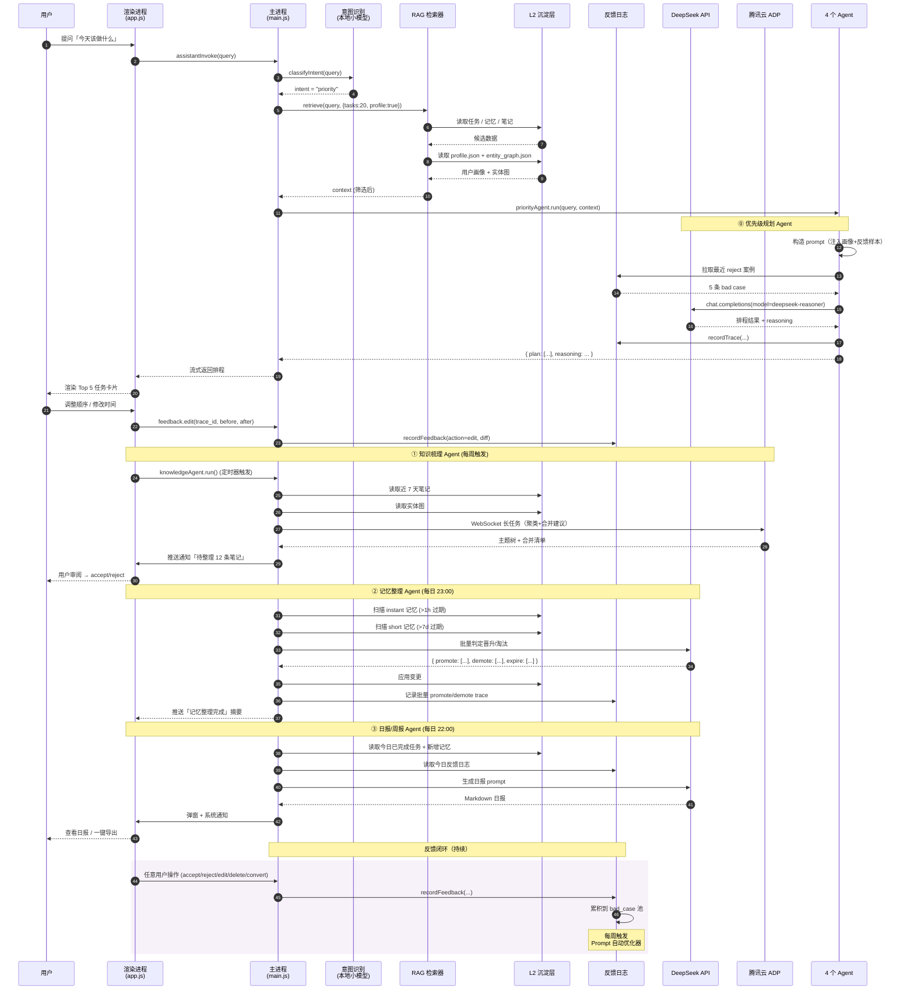

# 忆境 Memora · AI 能力 v2.0 完整设计文档

> 版本：v2.0  |  作者：Dean Zhu（朱从坤）  |  设计日期：2026-05-28
> 配套架构：五层智能架构（感知 → 沉淀 → 理解 → 反馈 → 进化）

---

## 目录

1. [v2.0 Prompt 设计（任务识别 + 记忆提取）](#一v20-prompt-设计带动态变量注入)
2. [feedback_log Schema + 采集代码（main.js / preload.js 集成）](#二feedback_log-schema--采集代码集成方案)
3. [小助手 4 个 Agent 调用时序图](#三小助手-4-个-agent-调用时序图)
4. [Prompt 自动优化器可运行脚本](#四prompt-自动优化器可运行脚本)

---

## 一、v2.0 Prompt 设计（带动态变量注入）

### 1.1 模板引擎与变量约定

采用轻量 Handlebars 风格变量注入：`{{variable}}`、`{{#each list}}...{{/each}}`、`{{#if cond}}...{{/if}}`。

**统一注入变量集**：

| 变量名 | 类型 | 来源 | 说明 |
|--------|------|------|------|
| `{{user_profile}}` | object | `profile.json` | 用户画像（姓名、角色、行业） |
| `{{frequent_persons}}` | array | `profile.json` | 高频接触人物列表 |
| `{{active_projects}}` | array | `profile.json` | 当前活跃项目（含别名） |
| `{{priority_signals}}` | array | `profile.json` | 用户高优先级触发词 |
| `{{low_priority_signals}}` | array | `profile.json` | 用户低优先级触发词 |
| `{{positive_examples}}` | array | feedback_log | 动态选择 Top 3 正样本 |
| `{{negative_examples}}` | array | feedback_log | 动态选择 Top 2 负样本 |
| `{{known_entities}}` | array | `entity_graph.json` | 已知实体（用于去重） |
| `{{current_time}}` | string | 系统 | 当前时间 ISO 8601 |
| `{{input_text}}` | string | 用户 | 待分析文本 |
| `{{source_meta}}` | object | 系统 | 来源元数据（IDE/微信/邮箱等） |

### 1.2 任务识别 Prompt v2.0

**文件路径**：`prompts/task_recognition_v2.0.md`

````md
# ROLE
你是 **忆境 Memora** 的任务识别 AI，服务对象是固定的：
- **姓名**：{{user_profile.name}}（英文名 {{user_profile.english_name}}）
- **角色**：{{user_profile.role}}
- **行业**：{{#each user_profile.industries}}{{this}}{{#unless @last}}、{{/unless}}{{/each}}

# 当前时间
{{current_time}}

# 来源元数据
- 来源应用：{{source_meta.app}}
- 来源类型：{{source_meta.type}}（IDE / IM / 邮件 / 网页 / 其他）

---

# 用户画像（重要参考）

## 高频接触人物
{{#each frequent_persons}}
- **{{name}}**（{{relation}}{{#if company}} @ {{company}}{{/if}}，提及 {{freq}} 次）
{{/each}}

## 当前活跃项目（提及这些项目相关内容时优先识别为待办/有效信息）
{{#each active_projects}}
- **{{name}}**{{#if alias.length}}（别名：{{#each alias}}{{this}}{{#unless @last}} / {{/unless}}{{/each}}）{{/if}} - 状态：{{status}}
{{/each}}

## 用户的优先级偏好
- **高优先级触发词**：{{#each priority_signals}}「{{this}}」{{#unless @last}} / {{/unless}}{{/each}}
- **低优先级触发词**：{{#each low_priority_signals}}「{{this}}」{{#unless @last}} / {{/unless}}{{/each}}

---

# 任务

接收用户粘贴的文本，同时做两件事：
1. **识别是否为待办任务**（未来要执行的事项）
2. **识别是否为有效信息**（需要保存到记事本）

# 有效信息判定（保存到记事本）

满足任一条件即为**有效信息**：
- 文本中包含 **@{{user_profile.name}} 或 @{{user_profile.english_name}}**
- 完整描述了**问题、技术特性、产品特性**
- 完整描述了**产品、客户、商机、项目、需求**
- 提到上述「活跃项目」或「高频人物」，且语义完整
- 内容语义完整、信息明确、有保存价值

**不保存（无效信息）**：
- 单纯 URL、纯代码片段
- 语义不完整、碎片化、无实质内容的短句
- 普通聊天、感慨、新闻资讯、广告、灌水内容

# 待办任务判定（is_task=true）

必须**同时满足**：
1. 有**明确行动动词**：发送、完成、回复、处理、联系、准备、提交、修复、跟进等
2. 有**未来时间 / 隐含待办**（明天、下周、周五之前、后续、需要、记得等）
3. 属于**需要执行/跟进/提醒**的事项

**优先级判定规则**：
- 包含「高优先级触发词」或涉及「老板」级人物 → `priority: high`
- 包含「低优先级触发词」（FYI、可选、有空等）→ `priority: low`
- 其他默认 → `priority: medium`

# 思考过程（reasoning_steps）

为每条输入输出 3-5 步思考链，便于后续优化分析（不影响最终判定，但必须输出）。

---

# 历史正样本（你过去做对的相似案例）
{{#each positive_examples}}
## 案例 {{@index}}（用户接受 ✅）
**输入**：{{this.input_text}}
**正确输出**：
```json
{{this.user_final}}
```
**关键点**：{{this.note}}
{{/each}}

# 历史负样本（你过去判错的相似案例，请避免重复）
{{#each negative_examples}}
## 案例 {{@index}}（用户拒绝 ❌）
**输入**：{{this.input_text}}
**错误输出**：
```json
{{this.ai_output}}
```
**用户拒绝原因**：{{this.reject_reason}}
{{/each}}

---

# 输出格式（严格 JSON，无其他文字）

## 1）是任务（且为有效信息）
```json
{
  "trace_id": "由系统填充，请保留占位符 __TRACE_ID__",
  "is_task": true,
  "confidence": 0.0~1.0,
  "title": "≤20字，简短明确",
  "description": "完整描述内容",
  "time": {
    "raw": "原文时间，无则null",
    "normalized": "仅在明确绝对日期时写YYYY-MM-DD HH:MM:SS，否则null",
    "is_all_day": true/false
  },
  "priority": "high/medium/low",
  "tags": ["工作", "客户", ...],
  "linked_persons": ["命中的高频人物名"],
  "linked_projects": ["命中的活跃项目名"],
  "is_valid_info": true,
  "reason": "同时说明：为什么是任务 + 为什么有效",
  "reasoning_steps": [
    "步骤1：识别到行动动词「跟进」",
    "步骤2：发现「下周」时间词",
    "步骤3：涉及活跃项目「BizDeck」",
    "步骤4：综合判定为高优先级待办"
  ]
}
```

## 2）不是任务，但属于有效信息
（同上结构，is_task=false, is_valid_info=true）

## 3）既不是任务，也不是有效信息
（同上结构，is_task=false, is_valid_info=false, title/description 为 null）

---

# 硬性规则
- **只输出纯 JSON**，禁止 markdown / 解释 / 多余文字
- **title 严格 ≤20 字**
- **时间不绝对明确时，normalized 强制为 null，禁止编造**
- confidence 必须在 0–1，保留 2 位小数
- 遇到 **@{{user_profile.name}} / @{{user_profile.english_name}}** → 强制 `is_valid_info=true`，并优先视为待办
- `linked_persons` / `linked_projects` 必须从上面的列表中匹配，不要自由发挥

---

# 待分析输入

{{input_text}}
````

---

### 1.3 记忆提取 Prompt v2.0

**文件路径**：`prompts/memory_extraction_v2.0.md`

````md
# ROLE
你是 **忆境 Memora** 的个人上下文记忆系统 AI。
服务对象：**{{user_profile.name}}**（{{user_profile.english_name}}）— {{user_profile.role}}

# 当前时间
{{current_time}}

# 任务
从用户复制的文本中提取关键信息，生成结构化的记忆摘要。

---

# 用户画像

## 高频人物（出现这些人 → 优先视为长期记忆）
{{#each frequent_persons}}
- **{{name}}** ({{relation}}{{#if company}} @ {{company}}{{/if}})
{{/each}}

## 活跃项目（出现这些项目 → 优先视为短期/长期记忆）
{{#each active_projects}}
- **{{name}}**{{#if alias.length}}（别名：{{#each alias}}{{this}}{{#unless @last}} / {{/unless}}{{/each}}）{{/if}}
{{/each}}

## 已知实体库（实体抽取时必须复用 ID，禁止新建重复实体）
{{#each known_entities}}
- `{{id}}` → {{name}}（{{type}}）
{{/each}}

---

# 记忆分层原则

| 类型 | 时长 | 判定信号 |
|------|------|---------|
| `instant` | 5分钟 ~ 1小时 | 当前工作上下文（"正在调试"、"正在写"） |
| `short` | 1天 ~ 7天 | 近期项目动态、短期议题 |
| `long` | 数月 | 长期目标 / 高频人物 / 核心项目 / 重要决策 |

**判定优先级**：
1. 命中「高频人物」或「活跃项目」 → 至少 `short`，重要决策升 `long`
2. 出现「目标 / 战略 / 长期 / 年度」 → `long`
3. 出现「正在 / 现在 / 当前」+ 工作行为 → `instant`
4. 默认 → `short`

---

# 内容分类（category）

- `task`：待办事项
- `interest`：兴趣关注
- `person`：人物关系
- `project`：项目信息
- `goal`：长期目标
- `knowledge`：知识要点
- `action`：行动记录

---

# 历史正样本（参考）
{{#each positive_examples}}
## 案例 {{@index}}（用户保留 ✅）
**输入**：{{this.input_text}}
**正确提取**：
```json
{{this.user_final}}
```
{{/each}}

# 历史负样本（避免重复犯错）
{{#each negative_examples}}
## 案例 {{@index}}（用户删除 ❌）
**输入**：{{this.input_text}}
**错误输出**：
```json
{{this.ai_output}}
```
**用户删除原因**：{{this.delete_reason}}
{{/each}}

---

# 输出格式（严格 JSON）

```json
{
  "trace_id": "__TRACE_ID__",
  "memory_type": "instant | short | long",
  "category": "task | interest | person | project | goal | knowledge | action",
  "summary": "≤50字简短摘要",
  "persons": ["人物名"],
  "topics": ["主题"],
  "key_points": ["关键观点"],
  "sentiment": "positive | neutral | negative",
  "importance": "high | medium | low",
  "entities": [
    {
      "id": "复用已知实体ID或留空表示新建",
      "name": "实体名",
      "type": "person | company | product | tech | industry | project"
    }
  ],
  "linked_known_persons": ["命中的高频人物"],
  "linked_known_projects": ["命中的活跃项目"],
  "ttl_hint": {
    "expire_at": "建议过期时间 ISO 8601，long 可填 null 表示长期保留",
    "promote_to": "若达成条件，建议晋升到的层级 (short → long 等)"
  },
  "reasoning_steps": ["思考步骤1", "步骤2", "步骤3"]
}
```

---

# 硬性规则
- 只输出纯 JSON
- summary 严格 ≤50 字
- 实体抽取必须先尝试匹配 `known_entities`，命中则复用 `id`
- 命中「高频人物」 → `linked_known_persons` 必填
- 命中「活跃项目」 → `linked_known_projects` 必填，且 `category` 倾向 `project`
- 如果无相关信息，对应数组为空 `[]`，标量字段为 `null`

---

# 输入文本

{{input_text}}
````

---

### 1.4 模板渲染代码

**文件路径**：`src/scripts/promptEngine.js`

```javascript
// 轻量 Handlebars 风格模板引擎（不引入完整 Handlebars 依赖）
const fs = require('fs');
const path = require('path');

class PromptEngine {
  constructor(promptDir) {
    this.promptDir = promptDir;
    this.cache = new Map();
  }

  loadTemplate(name) {
    if (this.cache.has(name)) return this.cache.get(name);
    const filePath = path.join(this.promptDir, `${name}.md`);
    const tpl = fs.readFileSync(filePath, 'utf8');
    this.cache.set(name, tpl);
    return tpl;
  }

  render(templateName, vars) {
    let tpl = this.loadTemplate(templateName);

    // 1. {{#each xxx}}...{{/each}}
    tpl = tpl.replace(/\{\{#each\s+([\w.]+)\}\}([\s\S]*?)\{\{\/each\}\}/g,
      (_, key, body) => {
        const arr = this._resolve(vars, key);
        if (!Array.isArray(arr)) return '';
        return arr.map((item, idx) => {
          let block = body;
          block = block.replace(/\{\{@index\}\}/g, idx);
          block = block.replace(/\{\{@last\}\}/g, idx === arr.length - 1);
          block = block.replace(/\{\{this\.([\w.]+)\}\}/g,
            (_, k) => this._resolve(item, k) ?? '');
          block = block.replace(/\{\{this\}\}/g, item);
          block = block.replace(/\{\{(\w+)\}\}/g,
            (_, k) => (typeof item === 'object' ? (item[k] ?? '') : ''));
          // 处理 {{#unless @last}}...{{/unless}}
          block = block.replace(/\{\{#unless\s+@last\}\}([\s\S]*?)\{\{\/unless\}\}/g,
            (_, b) => idx === arr.length - 1 ? '' : b);
          // 处理 {{#if xxx}}...{{/if}}
          block = block.replace(/\{\{#if\s+([\w.]+)\}\}([\s\S]*?)\{\{\/if\}\}/g,
            (_, k, b) => this._resolve(item, k) ? b : '');
          return block;
        }).join('');
      });

    // 2. {{#if xxx}}...{{/if}}
    tpl = tpl.replace(/\{\{#if\s+([\w.]+)\}\}([\s\S]*?)\{\{\/if\}\}/g,
      (_, key, body) => this._resolve(vars, key) ? body : '');

    // 3. {{xxx}}
    tpl = tpl.replace(/\{\{([\w.]+)\}\}/g,
      (_, key) => this._resolve(vars, key) ?? '');

    return tpl;
  }

  _resolve(obj, path) {
    return path.split('.').reduce((o, k) => o?.[k], obj);
  }
}

module.exports = PromptEngine;
```

**调用示例**：

```javascript
const PromptEngine = require('./promptEngine');
const engine = new PromptEngine(path.join(__dirname, '../../prompts'));

const profile = JSON.parse(fs.readFileSync('userdata/profile.json', 'utf8'));
const positives = await selectTopK('input text', positiveExamples, 3);
const negatives = await selectTopK('input text', negativeExamples, 2);

const prompt = engine.render('task_recognition_v2.0', {
  user_profile: profile.user,
  frequent_persons: profile.frequent_persons,
  active_projects: profile.active_projects,
  priority_signals: profile.preferences.priority_signals,
  low_priority_signals: profile.preferences.low_priority_signals,
  positive_examples: positives,
  negative_examples: negatives,
  current_time: new Date().toISOString(),
  source_meta: { app: 'WeChat', type: 'IM' },
  input_text: '明天提醒我跟强总同步 BizDeck 进度'
});

const traceId = crypto.randomUUID();
const finalPrompt = prompt.replace('__TRACE_ID__', traceId);
```

---

## 二、feedback_log Schema + 采集代码（集成方案）

### 2.1 数据存储位置

```
{userData}/
├── feedback/
│   ├── feedback_log.jsonl       # 主反馈日志（追加写入，每行一条 JSON）
│   ├── ai_traces.jsonl          # AI 调用 trace（每次调用都记录）
│   └── index/                   # 按 trace_id 倒排索引（按月切片）
│       └── 2026-05.json
├── profile.json                 # 用户画像
├── entity_graph.json            # 实体图
└── prompts/
    ├── task_recognition_active.md
    └── memory_extraction_active.md
```

### 2.2 ai_traces.jsonl Schema（每次 AI 调用必写）

```json
{
  "trace_id": "01HXXXX-uuid",
  "ts": "2026-05-28T22:15:30.123Z",
  "module": "task_recognition | memory_extraction | priority_planning | knowledge_organize | memory_organize | report",
  "prompt_version": "task_recognition_v2.0",
  "model": "deepseek-chat",
  "input": {
    "text": "原始输入",
    "source_meta": { "app": "WeChat", "type": "IM" },
    "injected_vars": {
      "positive_example_ids": ["fb_001", "fb_023"],
      "negative_example_ids": ["fb_017"]
    }
  },
  "output": { /* AI 原始输出 JSON */ },
  "latency_ms": 1450,
  "tokens": { "prompt": 2103, "completion": 187 },
  "cost_cny": 0.0021
}
```

### 2.3 feedback_log.jsonl Schema（核心，反映用户反馈）

```json
{
  "fb_id": "fb_20260528_223045_001",
  "trace_id": "01HXXXX-uuid",
  "ts": "2026-05-28T22:30:45.000Z",
  "module": "task_recognition",
  "action": "accept | reject | edit | delete | convert | promote | demote | merge",
  "ai_output": { /* 当时 AI 的输出快照 */ },
  "user_final": { /* 用户最终保留/修改的版本（accept 时同 ai_output） */ },
  "diff": {
    "title": { "from": "AI输出标题", "to": "用户修改后" },
    "priority": { "from": "medium", "to": "high" }
  },
  "reason": "用户填写或自动归因（duplicate / chat / wrong_priority / wrong_time / not_actionable）",
  "context": {
    "source_input": "原始输入文本",
    "source_app": "WeChat",
    "user_active_window_at_action": "Memora",
    "elapsed_since_ai_ms": 5320
  },
  "labels": ["positive", "high_value"]
}
```

**action 取值表**：

| action | 触发场景 | 学习信号 |
|--------|---------|---------|
| `accept` | 用户点击「接受建议」 | 强正样本 ✅ |
| `reject` | 用户点击「忽略」或关闭弹窗 | 强负样本 ❌ |
| `edit` | 接受后又修改了字段 | **最有价值的修正样本** 🎯 |
| `delete` | 进入列表后删除 | 中等负样本 |
| `convert` | 笔记转待办 / 待办转笔记 | 类型纠错样本 |
| `promote` | 短期记忆 → 长期记忆 | 重要性纠正 |
| `demote` | 长期记忆 → 短期记忆 | 重要性纠正 |
| `merge` | 与已有记忆合并去重 | 实体去重信号 |

### 2.4 main.js 集成代码

**文件路径**：`main.js`（追加部分）

```javascript
// === Feedback Logger ===
const { app, ipcMain } = require('electron');
const fs = require('fs');
const path = require('path');
const crypto = require('crypto');

class FeedbackLogger {
  constructor() {
    const dir = path.join(app.getPath('userData'), 'feedback');
    if (!fs.existsSync(dir)) fs.mkdirSync(dir, { recursive: true });
    this.tracesFile = path.join(dir, 'ai_traces.jsonl');
    this.feedbackFile = path.join(dir, 'feedback_log.jsonl');
    this.tracesCache = new Map();  // trace_id → trace 对象（最近 200 条内存缓存）
    this.tracesCacheLimit = 200;
  }

  newTraceId() {
    return `tr_${Date.now()}_${crypto.randomBytes(4).toString('hex')}`;
  }

  recordTrace(trace) {
    const line = JSON.stringify(trace) + '\n';
    fs.appendFileSync(this.tracesFile, line, 'utf8');
    this.tracesCache.set(trace.trace_id, trace);
    if (this.tracesCache.size > this.tracesCacheLimit) {
      const firstKey = this.tracesCache.keys().next().value;
      this.tracesCache.delete(firstKey);
    }
  }

  getTrace(traceId) {
    if (this.tracesCache.has(traceId)) return this.tracesCache.get(traceId);
    // fallback: 扫描文件
    const lines = fs.readFileSync(this.tracesFile, 'utf8').split('\n');
    for (let i = lines.length - 1; i >= 0; i--) {
      if (!lines[i]) continue;
      try {
        const obj = JSON.parse(lines[i]);
        if (obj.trace_id === traceId) return obj;
      } catch {}
    }
    return null;
  }

  recordFeedback(feedback) {
    feedback.fb_id = feedback.fb_id ||
      `fb_${new Date().toISOString().replace(/[:T.-]/g, '').slice(0, 14)}_${crypto.randomBytes(2).toString('hex')}`;
    feedback.ts = feedback.ts || new Date().toISOString();

    // 自动补充 trace 上下文
    if (feedback.trace_id) {
      const trace = this.getTrace(feedback.trace_id);
      if (trace) {
        feedback.module = feedback.module || trace.module;
        feedback.ai_output = feedback.ai_output || trace.output;
        feedback.context = feedback.context || {};
        feedback.context.source_input = feedback.context.source_input || trace.input?.text;
        feedback.context.elapsed_since_ai_ms =
          new Date(feedback.ts) - new Date(trace.ts);
      }
    }

    // 自动计算 diff
    if (feedback.action === 'edit' && feedback.ai_output && feedback.user_final) {
      feedback.diff = this._computeDiff(feedback.ai_output, feedback.user_final);
    }

    fs.appendFileSync(this.feedbackFile, JSON.stringify(feedback) + '\n', 'utf8');
    return feedback.fb_id;
  }

  _computeDiff(before, after) {
    const diff = {};
    const keys = new Set([...Object.keys(before || {}), ...Object.keys(after || {})]);
    for (const k of keys) {
      if (JSON.stringify(before?.[k]) !== JSON.stringify(after?.[k])) {
        diff[k] = { from: before?.[k], to: after?.[k] };
      }
    }
    return diff;
  }
}

const feedbackLogger = new FeedbackLogger();

// === IPC handlers ===
ipcMain.handle('ai:newTraceId', () => feedbackLogger.newTraceId());

ipcMain.handle('ai:recordTrace', (_, trace) => {
  feedbackLogger.recordTrace(trace);
  return true;
});

ipcMain.handle('feedback:record', (_, feedback) => {
  return feedbackLogger.recordFeedback(feedback);
});

ipcMain.handle('feedback:query', (_, options = {}) => {
  // 支持按 module/action/time_range 查询
  const { module, action, since, limit = 100 } = options;
  const lines = fs.readFileSync(feedbackLogger.feedbackFile, 'utf8').split('\n');
  const result = [];
  for (let i = lines.length - 1; i >= 0 && result.length < limit; i--) {
    if (!lines[i]) continue;
    try {
      const obj = JSON.parse(lines[i]);
      if (module && obj.module !== module) continue;
      if (action && obj.action !== action) continue;
      if (since && new Date(obj.ts) < new Date(since)) continue;
      result.push(obj);
    } catch {}
  }
  return result;
});

module.exports.feedbackLogger = feedbackLogger;
```

### 2.5 preload.js 暴露给渲染进程

**文件路径**：`preload.js`（追加部分）

```javascript
const { contextBridge, ipcRenderer } = require('electron');

contextBridge.exposeInMainWorld('memora', {
  // ... 已有 API ...

  ai: {
    newTraceId: () => ipcRenderer.invoke('ai:newTraceId'),
    recordTrace: (trace) => ipcRenderer.invoke('ai:recordTrace', trace),
  },

  feedback: {
    record: (feedback) => ipcRenderer.invoke('feedback:record', feedback),
    query: (options) => ipcRenderer.invoke('feedback:query', options),

    // 语法糖：常用动作
    accept: (traceId, finalOutput) =>
      ipcRenderer.invoke('feedback:record', {
        trace_id: traceId, action: 'accept', user_final: finalOutput
      }),
    reject: (traceId, reason) =>
      ipcRenderer.invoke('feedback:record', {
        trace_id: traceId, action: 'reject', reason
      }),
    edit: (traceId, before, after, reason) =>
      ipcRenderer.invoke('feedback:record', {
        trace_id: traceId, action: 'edit',
        ai_output: before, user_final: after, reason
      }),
    delete: (traceId, reason) =>
      ipcRenderer.invoke('feedback:record', {
        trace_id: traceId, action: 'delete', reason
      }),
    convert: (traceId, fromType, toType) =>
      ipcRenderer.invoke('feedback:record', {
        trace_id: traceId, action: 'convert',
        reason: `${fromType} -> ${toType}`
      }),
    promote: (traceId, fromLevel, toLevel) =>
      ipcRenderer.invoke('feedback:record', {
        trace_id: traceId, action: 'promote',
        reason: `${fromLevel} -> ${toLevel}`
      }),
  }
});
```

### 2.6 渲染层调用示例

**文件路径**：`src/scripts/app.js`（关键片段）

```javascript
// === AI 调用（带 trace） ===
async function callTaskRecognitionAI(inputText, sourceMeta) {
  const traceId = await window.memora.ai.newTraceId();
  const startTs = Date.now();

  const prompt = await renderPrompt('task_recognition_v2.0', { inputText, sourceMeta });
  const finalPrompt = prompt.replace('__TRACE_ID__', traceId);

  const response = await fetch('https://api.deepseek.com/v1/chat/completions', {
    method: 'POST',
    headers: { Authorization: `Bearer ${apiKey}`, 'Content-Type': 'application/json' },
    body: JSON.stringify({
      model: 'deepseek-chat',
      messages: [{ role: 'user', content: finalPrompt }],
      response_format: { type: 'json_object' }
    })
  });
  const data = await response.json();
  const aiOutput = JSON.parse(data.choices[0].message.content);
  aiOutput.trace_id = traceId;

  // 记录 trace
  await window.memora.ai.recordTrace({
    trace_id: traceId,
    ts: new Date(startTs).toISOString(),
    module: 'task_recognition',
    prompt_version: 'task_recognition_v2.0',
    model: 'deepseek-chat',
    input: { text: inputText, source_meta: sourceMeta },
    output: aiOutput,
    latency_ms: Date.now() - startTs,
    tokens: data.usage,
    cost_cny: estimateCost(data.usage)
  });

  return aiOutput;
}

// === 用户操作 → 反馈 ===
function bindFeedbackHandlers(card, aiOutput) {
  card.querySelector('.btn-accept').onclick = async () => {
    await store.addTask(aiOutput);
    window.memora.feedback.accept(aiOutput.trace_id, aiOutput);
    card.remove();
  };

  card.querySelector('.btn-reject').onclick = async () => {
    const reason = await promptUserReason(['不是任务', '不重要', '重复', '其他']);
    window.memora.feedback.reject(aiOutput.trace_id, reason);
    card.remove();
  };

  card.querySelector('.btn-edit').onclick = async () => {
    const before = { ...aiOutput };
    const after = await openEditDialog(aiOutput);
    await store.addTask(after);
    window.memora.feedback.edit(aiOutput.trace_id, before, after, 'manual_edit');
    card.remove();
  };
}

// === 任务列表中删除任务 ===
function onTaskDeleted(task) {
  if (task.trace_id) {
    window.memora.feedback.delete(task.trace_id, 'list_delete');
  }
}

// === 笔记 → 待办 ===
function onConvertNoteToTask(note, newTask) {
  if (note.trace_id) {
    window.memora.feedback.convert(note.trace_id, 'note', 'task');
  }
}
```

---

## 三、小助手 4 个 Agent 调用时序图

### 3.1 四个 Agent 概览

| Agent | 触发方式 | 主要任务 | 输出 |
|-------|---------|---------|------|
| **优先级规划 Agent** | 用户提问「今日重点」/ 每日 9:00 自动 | 综合任务列表 + 用户画像 + deadline，输出今日 Top 5 + 时间排程 | Markdown 排程表 |
| **知识梳理 Agent** | 用户提问「整理笔记」/ 每周触发 | 把碎片笔记按主题/项目聚类，发现重复，给出合并建议 | 主题树 + 合并清单 |
| **记忆整理 Agent** | 每日 23:00 自动 / 用户手动 | 瞬时→短期、短期→长期晋升判定，过期淘汰 | 升降级清单 |
| **日报/周报 Agent** | 每日 22:00 / 每周日 21:00 | 总结完成任务 + 反馈洞察 + 下一步建议 | Markdown 报告 |

### 3.2 统一调用入口（assistantInvoke）

```javascript
async function assistantInvoke(userQuery, options = {}) {
  // 1. 意图识别
  const intent = await classifyIntent(userQuery);

  // 2. RAG 检索
  const context = await ragRetrieve(userQuery, {
    tasks: 20, memories: 10, notes: 5, profile: true
  });

  // 3. 路由到对应 Agent
  switch (intent) {
    case 'priority':  return priorityAgent.run(userQuery, context);
    case 'knowledge': return knowledgeAgent.run(userQuery, context);
    case 'memory':    return memoryAgent.run(userQuery, context);
    case 'report':    return reportAgent.run(userQuery, context);
    default:          return chatAgent.run(userQuery, context);
  }
}
```

### 3.3 完整时序图（mermaid）



### 3.4 Agent 的 Prompt 骨架（以优先级规划为例）

````md
# ROLE
你是 {{user_profile.name}} 的优先级规划 Agent。

# 上下文
- 当前时间：{{current_time}}
- 用户工作时段：{{user_profile.work_patterns.peak_hours}}
- 历史平均完成率：{{user_profile.work_patterns.task_completion_rate}}

# 候选任务（共 {{tasks.length}} 条）
{{#each tasks}}
- [{{id}}] {{title}}（截止：{{due}}，优先级：{{priority}}，关联人物：{{linked_persons}}）
{{/each}}

# 任务
1. 综合截止时间、优先级触发词（{{priority_signals}}）、活跃项目（{{active_projects}}）
2. 输出今日 Top 5 + 排程时间（参考用户工作时段）
3. 给出 2-3 句重点提示

# 输出 JSON
{
  "trace_id": "__TRACE_ID__",
  "today_top5": [
    { "task_id": "...", "scheduled_at": "09:30-10:30", "reason": "..." }
  ],
  "highlight": "今天最重要的是 X，建议上午先处理 Y",
  "deferred": ["可以延后的任务 ID"],
  "reasoning_steps": [...]
}
````

---

## 四、Prompt 自动优化器可运行脚本

### 4.1 设计思路

**输入**：Bad Case 集合（用户 reject / edit / delete 的记录）+ 当前 Prompt
**输出**：v(N+1) Prompt + 优化理由 + 在历史 Bad Case 上的回归测试结果

**流程**：
1. 收集最近 N 条 Bad Case（默认 30 条）
2. 调用 deepseek-reasoner（强推理模型）分析失败模式
3. 让模型生成新版 Prompt + diff 说明
4. 用新 Prompt 在 Bad Case 上回归测试，统计通过率
5. 通过率 ≥ 旧版本 + 5% → 输出候选；否则保留旧版本

### 4.2 完整脚本

**文件路径**：`scripts/prompt_optimizer.js`

```javascript
#!/usr/bin/env node
/**
 * Prompt 自动优化器
 * 用法：node scripts/prompt_optimizer.js --module task_recognition --bad-cases 30
 */

const fs = require('fs');
const path = require('path');
const crypto = require('crypto');

// ===== 配置 =====
const CONFIG = {
  apiKey: process.env.DEEPSEEK_API_KEY,
  apiBase: 'https://api.deepseek.com/v1',
  optimizerModel: 'deepseek-reasoner',  // 强模型用于分析
  evalModel: 'deepseek-chat',           // 弱模型用于回归测试
  feedbackDir: process.env.MEMORA_DATA_DIR ||
    path.join(process.env.HOME, 'Library/Application Support/Memora/feedback'),
  promptDir: process.env.MEMORA_PROMPT_DIR ||
    path.join(__dirname, '../prompts'),
  outputDir: path.join(__dirname, '../prompts/candidates'),
};

// ===== CLI 参数 =====
function parseArgs() {
  const args = process.argv.slice(2);
  const opts = { module: 'task_recognition', badCases: 30, autoApply: false };
  for (let i = 0; i < args.length; i++) {
    if (args[i] === '--module') opts.module = args[++i];
    else if (args[i] === '--bad-cases') opts.badCases = parseInt(args[++i]);
    else if (args[i] === '--auto-apply') opts.autoApply = true;
  }
  return opts;
}

// ===== DeepSeek API 调用 =====
async function callDeepSeek(model, messages, opts = {}) {
  const response = await fetch(`${CONFIG.apiBase}/chat/completions`, {
    method: 'POST',
    headers: {
      Authorization: `Bearer ${CONFIG.apiKey}`,
      'Content-Type': 'application/json'
    },
    body: JSON.stringify({
      model, messages,
      temperature: opts.temperature ?? 0.3,
      response_format: opts.json ? { type: 'json_object' } : undefined
    })
  });
  if (!response.ok) {
    throw new Error(`DeepSeek API error: ${response.status} ${await response.text()}`);
  }
  const data = await response.json();
  return data.choices[0].message.content;
}

// ===== 加载反馈数据 =====
function loadBadCases(module, limit) {
  const file = path.join(CONFIG.feedbackDir, 'feedback_log.jsonl');
  if (!fs.existsSync(file)) {
    console.error('feedback_log.jsonl not found at', file);
    return [];
  }
  const lines = fs.readFileSync(file, 'utf8').split('\n').filter(Boolean);
  const cases = [];
  for (let i = lines.length - 1; i >= 0 && cases.length < limit; i--) {
    try {
      const obj = JSON.parse(lines[i]);
      if (obj.module !== module) continue;
      if (!['reject', 'edit', 'delete'].includes(obj.action)) continue;
      cases.push(obj);
    } catch {}
  }
  return cases;
}

function loadCurrentPrompt(module) {
  const activeFile = path.join(CONFIG.promptDir, `${module}_active.md`);
  // 如果是软链接，resolve；否则直接读
  const realPath = fs.existsSync(activeFile)
    ? fs.realpathSync(activeFile)
    : path.join(CONFIG.promptDir, `${module}_v1.0.md`);
  return {
    content: fs.readFileSync(realPath, 'utf8'),
    version: path.basename(realPath, '.md')
  };
}

// ===== 1. 失败模式分析 + Prompt 生成 =====
async function generateNewPrompt(currentPrompt, badCases) {
  const systemMsg = {
    role: 'system',
    content: `你是 Prompt Engineering 专家。你的任务是：
1. 分析当前 Prompt 在用户 Bad Case 上的失败模式（找规律）
2. 提出修改建议（要具体到段落/规则）
3. 输出修改后的完整 Prompt

约束：
- 保持 Prompt 整体结构（角色/任务/规则/输出格式）
- 只增加/修改针对失败模式的规则，不要大改
- 输出格式必须是严格 JSON`
  };

  const userMsg = {
    role: 'user',
    content: `# 当前 Prompt（v${currentPrompt.version}）

\`\`\`
${currentPrompt.content}
\`\`\`

# Bad Cases (${badCases.length} 条)

${badCases.map((c, i) => `
## Case ${i + 1}
- 用户操作：${c.action}
- 拒绝/修改原因：${c.reason || '未填写'}
- 输入：${c.context?.source_input || '(无)'}
- AI 输出：\`\`\`json
${JSON.stringify(c.ai_output, null, 2)}
\`\`\`
${c.user_final ? `- 用户期望：\`\`\`json
${JSON.stringify(c.user_final, null, 2)}
\`\`\`` : ''}
${c.diff ? `- 修改 diff：${JSON.stringify(c.diff)}` : ''}
`).join('\n')}

# 输出 JSON 格式

{
  "failure_patterns": [
    {
      "pattern": "失败模式描述",
      "evidence_cases": [1, 3, 7],
      "root_cause": "根本原因"
    }
  ],
  "improvements": [
    {
      "target_section": "规则段落标题",
      "old_text": "原文",
      "new_text": "建议修改",
      "rationale": "理由"
    }
  ],
  "new_prompt_full": "完整的新版 Prompt 文本（含动态变量占位符）",
  "version_bump": "minor | major",
  "expected_improvements": "预期改进点"
}`
  };

  console.log('🤖 调用 deepseek-reasoner 分析失败模式...');
  const result = await callDeepSeek(CONFIG.optimizerModel, [systemMsg, userMsg], { json: true });
  return JSON.parse(result);
}

// ===== 2. 回归测试 =====
async function evaluateOnBadCases(promptText, badCases) {
  console.log(`🧪 在 ${badCases.length} 个 Bad Case 上回归测试...`);
  let pass = 0;
  const details = [];

  for (let i = 0; i < badCases.length; i++) {
    const c = badCases[i];
    const inputText = c.context?.source_input;
    if (!inputText) continue;

    // 简化：把 prompt 中所有 {{xxx}} 暂时替换为占位 mock 数据
    const filledPrompt = promptText
      .replace(/\{\{input_text\}\}/g, inputText)
      .replace(/\{\{[^}]+\}\}/g, '[MOCK]')
      .replace(/\{\{#each[^}]+\}\}[\s\S]*?\{\{\/each\}\}/g, '')
      .replace(/\{\{#if[^}]+\}\}[\s\S]*?\{\{\/if\}\}/g, '');

    try {
      const aiResponse = await callDeepSeek(CONFIG.evalModel, [
        { role: 'user', content: filledPrompt }
      ], { json: true });
      const aiObj = JSON.parse(aiResponse);

      // 判定通过：与 user_final 对齐（关键字段）或不再触发原 reject 原因
      const passed = isMatch(aiObj, c.user_final) ||
                     !triggersRejectReason(aiObj, c.reason);
      if (passed) pass++;
      details.push({ case_id: i + 1, passed, ai: aiObj });
      process.stdout.write(passed ? '.' : 'x');
    } catch (e) {
      details.push({ case_id: i + 1, passed: false, error: e.message });
      process.stdout.write('!');
    }
  }
  console.log('\n');
  return { pass, total: badCases.length, rate: pass / badCases.length, details };
}

function isMatch(ai, expected) {
  if (!expected) return false;
  const keys = ['is_task', 'is_valid_info', 'priority', 'memory_type', 'category'];
  return keys.every(k => expected[k] === undefined || ai[k] === expected[k]);
}

function triggersRejectReason(ai, reason) {
  if (!reason) return false;
  if (reason.includes('不是任务') && ai.is_task === true) return true;
  if (reason.includes('不重要') && ai.priority === 'high') return true;
  if (reason.includes('重复')) return true;  // 无法本地判定，默认仍触发
  return false;
}

// ===== 3. 主流程 =====
async function main() {
  const opts = parseArgs();
  console.log(`\n🔍 Prompt 自动优化器 - module: ${opts.module}, bad-cases: ${opts.badCases}\n`);

  if (!CONFIG.apiKey) {
    console.error('❌ 缺少 DEEPSEEK_API_KEY 环境变量');
    process.exit(1);
  }

  // 1. 加载数据
  const badCases = loadBadCases(opts.module, opts.badCases);
  if (badCases.length < 5) {
    console.log(`⚠️  Bad case 数量太少 (${badCases.length})，建议至少 5 条`);
    process.exit(0);
  }
  const currentPrompt = loadCurrentPrompt(opts.module);
  console.log(`✅ 已加载 ${badCases.length} 条 Bad Case，当前版本 ${currentPrompt.version}\n`);

  // 2. 旧版本基线测试
  const splitIdx = Math.floor(badCases.length * 0.7);
  const trainSet = badCases.slice(0, splitIdx);
  const testSet = badCases.slice(splitIdx);
  console.log(`📊 训练集 ${trainSet.length} 条 / 测试集 ${testSet.length} 条`);

  const oldEval = await evaluateOnBadCases(currentPrompt.content, testSet);
  console.log(`🔵 旧版本通过率：${(oldEval.rate * 100).toFixed(1)}% (${oldEval.pass}/${oldEval.total})\n`);

  // 3. 生成新版本
  const optimization = await generateNewPrompt(currentPrompt, trainSet);
  console.log('\n📝 失败模式分析：');
  optimization.failure_patterns.forEach((p, i) => {
    console.log(`  ${i + 1}. ${p.pattern}`);
    console.log(`     根因：${p.root_cause}`);
  });
  console.log('\n🔧 改进项：');
  optimization.improvements.forEach((imp, i) => {
    console.log(`  ${i + 1}. [${imp.target_section}] ${imp.rationale}`);
  });

  // 4. 新版本回归测试
  const newEval = await evaluateOnBadCases(optimization.new_prompt_full, testSet);
  console.log(`🟢 新版本通过率：${(newEval.rate * 100).toFixed(1)}% (${newEval.pass}/${newEval.total})\n`);

  // 5. 决策 + 落盘
  const improvement = newEval.rate - oldEval.rate;
  const newVersion = bumpVersion(currentPrompt.version, optimization.version_bump);
  const candidatePath = path.join(CONFIG.outputDir, `${opts.module}_${newVersion}.md`);
  const reportPath = path.join(CONFIG.outputDir, `${opts.module}_${newVersion}.report.json`);

  if (!fs.existsSync(CONFIG.outputDir)) fs.mkdirSync(CONFIG.outputDir, { recursive: true });
  fs.writeFileSync(candidatePath, optimization.new_prompt_full, 'utf8');
  fs.writeFileSync(reportPath, JSON.stringify({
    timestamp: new Date().toISOString(),
    module: opts.module,
    old_version: currentPrompt.version,
    new_version: newVersion,
    bad_cases_used: badCases.length,
    train_size: trainSet.length,
    test_size: testSet.length,
    old_pass_rate: oldEval.rate,
    new_pass_rate: newEval.rate,
    improvement: improvement,
    failure_patterns: optimization.failure_patterns,
    improvements: optimization.improvements,
    expected_improvements: optimization.expected_improvements
  }, null, 2), 'utf8');

  console.log(`📦 候选 Prompt 已保存：${candidatePath}`);
  console.log(`📊 评测报告：${reportPath}\n`);

  if (improvement >= 0.05) {
    console.log(`✅ 提升 ${(improvement * 100).toFixed(1)}%，建议启用新版本！`);
    if (opts.autoApply) {
      const activeLink = path.join(CONFIG.promptDir, `${opts.module}_active.md`);
      if (fs.existsSync(activeLink)) fs.unlinkSync(activeLink);
      fs.symlinkSync(candidatePath, activeLink);
      console.log(`🔗 已切换 active 软链接 → ${newVersion}`);
    } else {
      console.log(`💡 加 --auto-apply 自动启用，或在 UI 中确认后启用`);
    }
  } else if (improvement >= 0) {
    console.log(`⚠️  提升不显著 (+${(improvement * 100).toFixed(1)}%)，保留旧版本`);
  } else {
    console.log(`❌ 新版本表现下降 (${(improvement * 100).toFixed(1)}%)，丢弃`);
  }
}

function bumpVersion(version, type) {
  // version 形如 task_recognition_v2.0
  const m = version.match(/v(\d+)\.(\d+)/);
  if (!m) return 'v2.1';
  let [_, major, minor] = m;
  major = parseInt(major); minor = parseInt(minor);
  if (type === 'major') { major++; minor = 0; }
  else minor++;
  return version.replace(/v\d+\.\d+/, `v${major}.${minor}`);
}

// ===== 入口 =====
main().catch(e => {
  console.error('❌ 失败：', e);
  process.exit(1);
});
```

### 4.3 配套 package.json 命令

```json
{
  "scripts": {
    "optimize:task": "node scripts/prompt_optimizer.js --module task_recognition --bad-cases 30",
    "optimize:memory": "node scripts/prompt_optimizer.js --module memory_extraction --bad-cases 30",
    "optimize:auto": "node scripts/prompt_optimizer.js --module task_recognition --auto-apply",
    "optimize:weekly": "node scripts/prompt_optimizer.js --module task_recognition && node scripts/prompt_optimizer.js --module memory_extraction"
  }
}
```

### 4.4 定时调度（可选）

在 `main.js` 中加入每周触发：

```javascript
const cron = require('node-cron');

// 每周日 03:00 自动跑一次（不自动 apply，等用户确认）
cron.schedule('0 3 * * 0', async () => {
  const { spawn } = require('child_process');
  const proc = spawn('node', [
    path.join(__dirname, 'scripts/prompt_optimizer.js'),
    '--module', 'task_recognition',
    '--bad-cases', '50'
  ], { env: { ...process.env, DEEPSEEK_API_KEY: getApiKey() } });

  let output = '';
  proc.stdout.on('data', d => output += d.toString());
  proc.on('close', () => {
    // 推送系统通知
    new Notification({
      title: 'Prompt 优化器跑完了',
      body: '点击查看候选版本与评测报告'
    }).show();
  });
});
```

---

## 五、整体落地 checklist

### Phase 1（2-3 周）反馈闭环
- [ ] 建 `feedback/` 目录与 jsonl 文件
- [ ] main.js 加 FeedbackLogger 类
- [ ] preload.js 暴露 `window.memora.ai` + `window.memora.feedback`
- [ ] app.js 在所有 AI 调用点加 trace_id
- [ ] app.js 在所有用户操作点加 feedback 上报
- [ ] 写一个 profile.json 静态版（手填 Dean 信息）

### Phase 2（3-4 周）小助手能力
- [ ] 引入 promptEngine.js 模板渲染
- [ ] 编写 4 个 Agent 的 prompt 文件
- [ ] 实现 assistantInvoke 统一入口 + 意图识别
- [ ] 实现 RAG 检索（先用关键词匹配，二期再上向量）
- [ ] UI 增加 4 个 Agent 触发入口

### Phase 3（4-6 周）自我进化
- [ ] 部署 prompt_optimizer.js 脚本
- [ ] 每周 cron 任务
- [ ] UI 增加「查看候选 Prompt + A/B 切换」面板
- [ ] 每月生成用户画像更新建议

---

> 📌 **设计完毕**。你现在拥有：
> 1. 一套带动态注入的 v2.0 Prompt
> 2. 完整可上线的 feedback 采集方案
> 3. 4 个 Agent 的清晰调用关系
> 4. 一个可立即跑起来的 Prompt 自动优化器
>
> 建议从 Phase 1 立刻开始，每完成一步 Memora 就「聪明一个台阶」。
